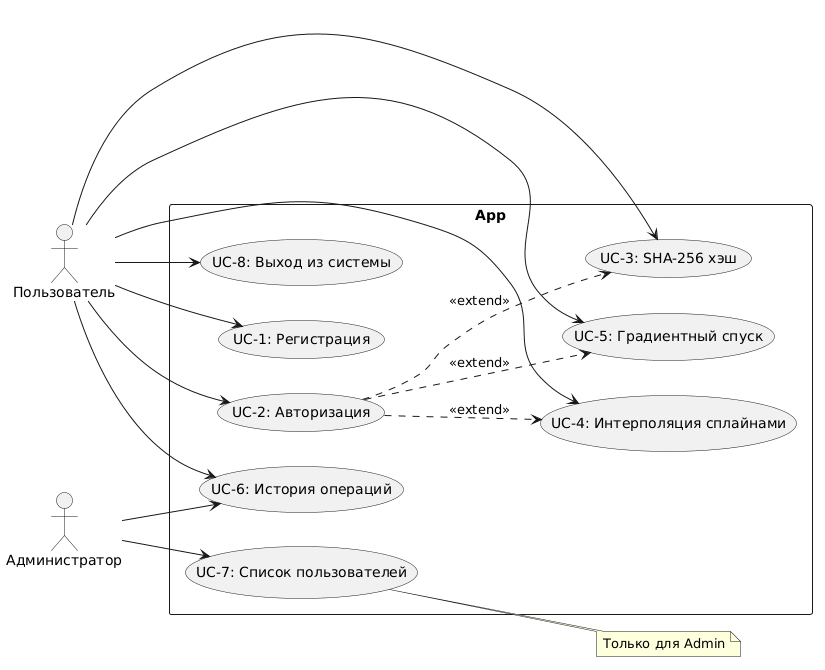

# Архитектура проекта

## Компоненты
- **Сервер** - TCP сервер на порту 33333
- **Клиент** - Qt6 GUI приложение
- **БД** - SQLite (синглтон)
- **Криптография** - Triple DES, SHA-256
- **Математика** - сплайны, градиентный спуск

## Диаграммы

